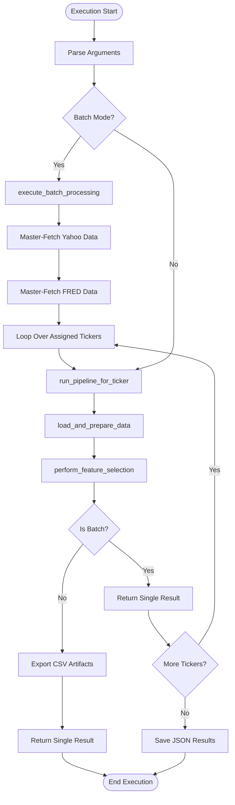

# Source Code

This directory contains the core implementation of the quantitative ETF forecasting pipeline. 

* `app.py`: Defines the Streamlit web application. Facilitates interactive data exploration, backtest evaluation, and visualization of batch predictions.
* `audit.py`: Generates markdown-based audit trails for feature selection and model parameters. Logs selected variables, p-values, and model coefficients for compliance and review.
* `config.py`: Stores static configuration parameters, including API keys, file paths, target instrument lists, and predefined macroeconomic indicator selections.
* `data_pipeline.py`: Executes data ingestion and feature engineering. Fetches financial time series, computes rolling returns, generates interaction ratios, and defines the target classification logic.
* `evaluation.py`: Computes validation metrics for the predictive models. Evaluates out-of-sample accuracy and utilizes Kolmogorov-Smirnov statistics to determine optimal probability thresholds for classification cutoffs.
* `main.py`: Orchestrates the quantitative pipeline. Serves as the entry point for data ingestion, feature selection, model training, evaluation, and report generation.
* `modeling.py`: Implements the machine learning logic. Features class-weight balancing, temporal cross-validation, and a logistic regression classifier with Sequential Feature Selection (SFS). Applies dual-cutoff probability rules for risk-adjusted predictions.

## Runtime View

